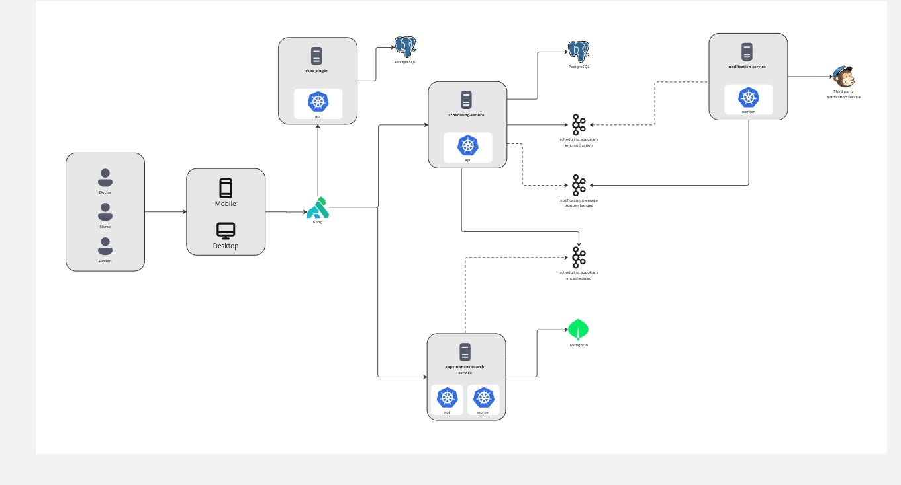
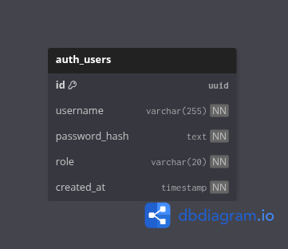

# auth-service

Serviço responsável por autenticação e autorização centralizadas no **Kong**, com um plugin customizado em **Lua** para login, emissão de JWT e repasse do contexto de usuário para os serviços protegidos.

## Visão geral

- O acesso ao sistema passa pelo Kong.
- O plugin `auth-rbac` autentica o usuário em PostgreSQL.
- O Kong emite um JWT com `sub` e `role`.
- Requisições autenticadas recebem os headers `X-User-ID` e `X-User-Roles`.
- Os serviços internos continuam focados nas regras de negócio.

## Stack

- Kong Gateway
- Lua
- PostgreSQL
- JWT
- Docker e Docker Compose

## Arquitetura

### Fluxo de autenticação

1. O cliente envia `POST /api/v1/auth/login`.
2. O plugin `auth-rbac` valida `username` e `password`.
3. O Kong consulta a tabela `auth_users` no PostgreSQL.
4. Se as credenciais estiverem corretas, o Kong gera um JWT.
5. Em requisições protegidas, o JWT é validado e os headers internos são adicionados.

### Serviços configurados no Kong

- `api-service-java` em `http://host.docker.internal:8080`
- `graphql-service-java` em `http://host.docker.internal:8084`

## Diagramas

### Arquitetura da solução



### Banco de dados



## Plugin em Lua

O plugin customizado `kong/plugins/auth-rbac/handler.lua` é responsável por:

- receber o payload de login;
- buscar o usuário no PostgreSQL;
- validar a senha com `crypt`;
- gerar o JWT com `iss`, `sub`, `role`, `iat` e `exp`;
- validar o token nas rotas protegidas;
- injetar `X-User-ID` e `X-User-Roles` para o upstream.

## Usuários seedados

| Usuário | Role | Senha |
| --- | --- | --- |
| `doctor@example.com` | `DOCTOR` | `123456` |
| `nurse@example.com` | `NURSE` | `123456` |
| `patient@example.com` | `PATIENT` | `123456` |
| `admin@example.com` | `ADMIN` | `123456` |

## Endpoints expostos via Kong

| Método | Endpoint | Serviço de destino | Observação |
| --- | --- | --- | --- |
| `POST` | `/api/v1/auth/login` | Plugin `auth-rbac` | Autentica o usuário e retorna o JWT |
| `GET`, `POST`, `PUT`, `DELETE` | `/api/v1/appointments` | `api-service-java` | Rota protegida com RBAC |
| `GET`, `POST`, `OPTIONS` | `/graphql` | `graphql-service-java` | Rota protegida com RBAC |

## Collection de login

A collection Postman com login e requests protegidos está em:

- [docs/auth-service.postman_collection.json](docs/auth-service.postman_collection.json)

### Exemplo do request

```http
POST /api/v1/auth/login
Content-Type: application/json

{
  "username": "doctor@example.com",
  "password": "123456"
}
```

Os requests protegidos da collection usam `Authorization: Bearer {{access_token}}`, onde `access_token` é preenchido pela resposta do login.

## Execução local

### Subir a infraestrutura

```bash
docker compose up -d
```

### Endereços úteis

- Kong Proxy: `http://localhost:8000`
- Kong Admin API: `http://localhost:8001`

## Estrutura resumida

- `kong/config/kong.yml` - configuração declarativa do Kong
- `kong/plugins/auth-rbac/handler.lua` - plugin customizado de autenticação
- `kong/bootstrap/users.sql` - seed dos usuários
- `docs/` - diagramas do projeto
- `docs/auth-service.postman_collection.json` - collection com login e requests protegidos
